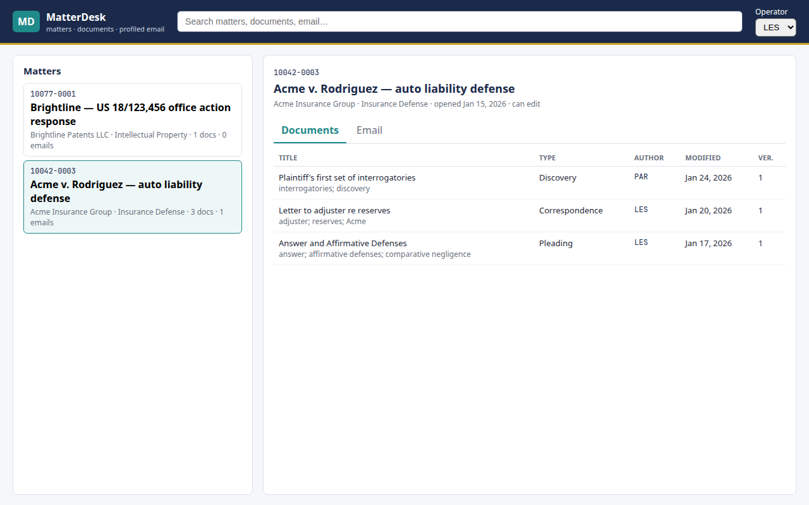

# MatterDesk

A small, complete slice of a matter-centric document and email profiling API, built to the shape of a
law-practice "all-in-one" system: the **matter is the hub**, documents and email are **profiled** onto it,
and **permissions live in the query**.

Stack: ASP.NET Core 8 (controllers) · EF Core 8 (SQL Server / SQLite) · Microsoft Graph SDK 6 (delta sync) ·
OIDC bearer auth · MCP server (tools for AI clients) · React 19 + Vite + TypeScript · xUnit integration tests ·
Playwright end-to-end · Azure Pipelines.

Prepared by Luis Escobar for PerfectLaw, October 2026. The background behind it — how I think about the
Microsoft platform (Azure / Microsoft 365 / Entra / Graph / EWS), the integration and automation work that
transfers to a Graph sync layer, MCP, and my database experience stated exactly — is in
**[docs/BACKGROUND.md](docs/BACKGROUND.md)** and on the app's **About this project** page.



## Why these particular choices

| Concern | What this project does | Why |
|---|---|---|
| **Authorization** | `MatterAccessPolicy.VisibleTo()` is an `IQueryable` extension composed into every read. It translates to an `EXISTS` probe against `MatterAccess`. | A user outside a restricted matter must get an **empty result**, not a row filtered after the fact. Search, lists and detail all share one predicate. |
| **403 vs 404** | `GET /api/matters/{id}` returns 403 when the matter exists but is restricted; `GET /api/documents/{id}` returns 404. | Matter numbers are on every bill and are not secret, so an explicit, auditable denial is fine. A document id must not reveal that a restricted file exists. |
| **Concurrency** | `Document.Version` is an EF concurrency token. `PUT /api/documents/{id}/profile` requires `If-Match` and returns **409** with a problem-details body on mismatch, **428** if the header is missing. | Two people editing the same profile must not silently overwrite each other. On SQL Server this would normally be a `rowversion` column; a counter is used so the same model runs on SQLite in tests. |
| **Transactions** | Profile row + first version row are created in a single `SaveChanges`. | They must commit together. |
| **Pagination** | Mandatory on every list; `pageSize` clamped to 200; `PagedResult<T>` with `total` and `hasMore`. | Mail and document tables are large. |
| **Errors** | `AddProblemDetails()` plus an explicit `InvalidModelStateResponseFactory`; every failure is RFC 7807 `application/problem+json`. | One error shape for the React client and the tests. |
| **Graph** | `GraphMailSource` uses **delta queries** on the Inbox, persists the delta link per operator, and marks filed messages with an Outlook **category** (`Filed: 10042-0003`). Delegated (device code) and Application (client credentials) modes. | Replaces the EWS-era approach (public-folder watcher / MAPI polling) that Exchange Online stops serving on 1 April 2027. Never pulls a full mailbox twice. |
| **Idempotency** | `(MatterId, ExternalMessageId)` is unique; a message already filed is skipped; the profile row is durable *before* the marker is attempted and a marker failure does not roll it back. | Sync must be safe to re-run after any partial failure. |
| **Auth plumbing** | A policy scheme forwards to **JWT Bearer** (Entra ID / any OIDC issuer) when an `Authorization` header is present; in Development/Testing only, an `X-Operator-Code` header scheme is available. | Production uses OIDC; tests and local demos do not need a tenant. The dev scheme is not registered outside those environments. |
| **Search** | `UNION ALL` of matters, documents and emails projected to one shape server-side, ordered and paged in SQL. | On SQL Server the text match would use the full-text index (`CONTAINS`); `LIKE` keeps the plan shape identical on SQLite. |
| **Data access** | EF Core with explicit indexes in `OnModelCreating` (`(OperatorId, MatterId)` for the permission probe; `(MatterId, DocumentType)`; `(MatterId, ExternalMessageId)` unique). | The predicate and the hot paths have the indexes they need. Stored procedures would still be used where a rule is shared with a desktop client. |
| **MCP** | `POST /mcp` is a minimal Model Context Protocol server (Streamable HTTP, protocol `2025-06-18`) exposing `search_matters`, `get_matter` and `list_documents`. Tools run under the authenticated operator and reuse `SearchService` and `MatterAccessPolicy`. | An agent (Copilot, Claude, Cursor, a custom assistant) gets governed, permission-aware access to the same data with no copy of it anywhere. The server, not the model, enforces who sees what. |

## Coverage against the posting

| Posting line | Here |
|---|---|
| REST conventions (routing, methods, status codes, validation, errors, authorization, filtering, sorting) | `Controllers/`, problem+json everywhere, Swagger |
| SQL Server: indexes, plans, concurrency, transactions, large DMS data | `Data/MatterDeskDbContext.cs`, `Document.Version`, paging, server-side `UNION ALL` |
| React across the API boundary | `src/MatterDesk.Web` |
| Profiles, metadata, search, permissions, versions, relationships, full-text | `Domain/`, `Authorization/`, `Search/` |
| Microsoft Graph / Exchange–Outlook | `Mail/GraphMailSource.cs`, `Mail/EmailProfilingService.cs` |
| OAuth / OIDC | `Auth/`, `Program.cs` |
| Azure DevOps / CI | `azure-pipelines.yml` |
| Automated testing incl. Playwright | `tests/` (23 API + 6 e2e) |
| AI-assisted development with human-owned review | "How this was built" below; MCP server at `/mcp` |

The full line-by-line map, including what is marked *ramping* or *not yet*, is in [docs/BACKGROUND.md](docs/BACKGROUND.md#5-the-posting-requirement-by-requirement).

## Run it

Prerequisites: .NET 8 SDK, Node 20+, Google Chrome (for Playwright `channel: 'chrome'`).

```bash
# API (SQLite by default; set ConnectionStrings__SqlServer to use SQL Server)
cd src/MatterDesk.Api
dotnet run --urls http://localhost:5080
# Swagger UI: http://localhost:5080/swagger  (use the DevHeader lock: LES, JDU or PAR)

# Web
cd src/MatterDesk.Web
npm install && npm run dev      # http://localhost:5173, proxies /api to :5080
```

Try the permission boundary directly:

```bash
curl -H "X-Operator-Code: LES" http://localhost:5080/api/matters                 # 2 matters
curl -H "X-Operator-Code: JDU" http://localhost:5080/api/matters                 # 3 matters (one restricted)
curl -H "X-Operator-Code: LES" "http://localhost:5080/api/search?q=Falcon"       # total: 0
curl -H "X-Operator-Code: JDU" "http://localhost:5080/api/search?q=Falcon"       # matter + 2 documents
```

And the same boundary through MCP (what an AI client would send):

```bash
curl -s -X POST http://localhost:5080/mcp -H "Content-Type: application/json" -H "X-Operator-Code: LES" \
  -d '{"jsonrpc":"2.0","id":1,"method":"tools/list"}'
curl -s -X POST http://localhost:5080/mcp -H "Content-Type: application/json" -H "X-Operator-Code: LES" \
  -d '{"jsonrpc":"2.0","id":2,"method":"tools/call","params":{"name":"search_matters","arguments":{"query":"Falcon"}}}'   # total: 0
curl -s -X POST http://localhost:5080/mcp -H "Content-Type: application/json" -H "X-Operator-Code: JDU" \
  -d '{"jsonrpc":"2.0","id":3,"method":"tools/call","params":{"name":"list_documents","arguments":{"matterNumber":"10099-0001"}}}'
```

To point an MCP client at it, configure an HTTP server with URL `http://localhost:5080/mcp` and the
`X-Operator-Code` header (or a Bearer token in production).

## Hosted demo

A hosted copy runs with the seeded demo data (no real client data) and the operator header enabled
through `Auth:AllowDevHeader=true`. Switch the operator in the top-right to see the permission boundary
move; open **About this project** for the background. Live at **https://szhzkeau4r.us-east-1.awsapprunner.com** (Swagger at `/swagger`, MCP at `/mcp`).

How it is hosted: one container (the API serves the React build from `wwwroot`, with a SPA fallback
that leaves `/api`, `/mcp` and `/swagger` alone), built by `dotnet publish /t:PublishContainer` with
no Docker daemon, pushed to Amazon ECR and run on AWS App Runner behind its managed HTTPS endpoint.
`deploy/aws-apprunner.sh` does the whole thing idempotently (ECR repo, image, pull role, service
create-or-update, health check on `/healthz`). The same image runs anywhere a container runs,
including Azure App Service or Azure Container Apps.

## Tests

```bash
# API integration tests: real pipeline, SQLite in-memory, fake Graph source — 23 tests
dotnet test

# End-to-end: boots the API and Vite, drives the React screen in Chrome — 6 tests
cd tests/e2e && npm install && npx playwright test
```

What the suites prove:

- **Permissions** — unauthenticated → 401; unknown operator → 403; the restricted matter is absent from lists; `GET` is 200 for the granted operator and 403 for the other; its documents are 404 for the other; search returns zero hits for `Falcon` and never shows a restricted document even when a keyword (`Acme`) matches; a viewer without `CanEdit` cannot profile.
- **Profiles** — 201 with `Location`, version 1 and one version row; validation errors are `application/problem+json`; `PUT` without `If-Match` → 428; stale version → 409; reload and retry → 200; `ETag` matches the version.
- **Mail sync** — delta paging across pages; second sync scans zero and resumes from the stored delta link; a message tagged with a restricted matter is **not** filed by an ungranted operator but is by a granted one; marker failure keeps the profile and reports `MarkerSet = false`; per-matter sync files only into that matter and honours edit rights.
- **MCP** — unauthenticated → 401; `initialize` / `tools/list` describe three tools; `search_matters` for `Falcon` returns zero hits as LES and hits as JDU; `get_matter` / `list_documents` on the restricted matter return an error for LES that does not reveal the title, and data for JDU; an unsupported method is a JSON-RPC `-32601`, not a crash.
- **End-to-end** — the React screen shows the right matters per operator, loads documents and email, shows no results for restricted content, confirms the API returns 403 and a zero-hit search for the ungranted operator, opens the About page from the nav and from `#about`, and exercises the MCP endpoint over HTTP.

## Connect Microsoft Graph (optional)

1. Register an app in Entra ID. For delegated mode: public client, allow device-code flow, API permission `Mail.ReadWrite` (delegated). For application mode: a client secret, `Mail.ReadWrite` (application) with admin consent, and an **Exchange application access policy** so the app can reach only the mailboxes it should.
2. Configure:

```json
"Graph": { "Mode": "Delegated", "TenantId": "<tenant>", "ClientId": "<app id>" }
```

3. `POST /api/mail/sync`. In delegated mode the first call logs a device-code prompt; the token cache persists afterwards. Messages whose subject contains a visible matter number (`[10042-0003]`) are filed and tagged in Outlook.

## Layout

```
src/MatterDesk.Api
  Auth/            policy scheme, JWT bearer, dev header scheme, current-operator middleware
  Authorization/   MatterAccessPolicy — the predicate, once
  Controllers/     Matters, Documents, Search, MailSync, Mcp (JSON-RPC over Streamable HTTP)
  Data/            DbContext (indexes, concurrency token bump), Seed
  Domain/          Operator, Client, Matter, MatterAccess, Document, DocumentVersion, ProfiledEmail, MailSyncState
  Mail/            IMailSource, GraphMailSource (delta + category marker), EmailProfilingService
  Mcp/             MatterTools — tool descriptors and handlers, operator-scoped
  Search/          SearchService — the UNION ALL search shared by REST and MCP
src/MatterDesk.Web react screen: matter list, documents/email tabs, search, operator switcher, About page
tests/MatterDesk.Api.Tests  xUnit + WebApplicationFactory + SQLite in-memory + FakeMailSource
tests/e2e                   Playwright (Chrome) with webServer bootstrapping both apps
docs/                       BACKGROUND.md (platform model, integration experience, MCP, data), screenshots
azure-pipelines.yml         build, API tests, web build, Playwright
```

## What I would do differently in a real codebase

- Migrations (`dotnet ef migrations`) in the release pipeline instead of `EnsureCreated` at startup.
- `rowversion` on SQL Server for the concurrency token; full-text index and `CONTAINS` for document/email text; a persisted computed column for the matter-number token in subjects.
- Graph **change notifications** (webhooks with lifecycle renewal) to trigger sync instead of a manual `POST`; a background worker with per-tenant throttling and `Retry-After` handling.
- Audit rows for every denied access and every profile change.
- A policy-based authorization handler (`IAuthorizationRequirement`) wrapping `MatterAccessPolicy` so controllers declare `[Authorize(Policy = "CanViewMatter")]` instead of calling the probe.
- The official `ModelContextProtocol` SDK with SSE streaming, resources (`matter://10042-0003`) and OAuth resource-indicator metadata, once the tool set is larger than three; the hand-rolled endpoint here keeps the authorization path visible in one file.

## How this was built

Spec first (the table above), then code, with an AI coding assistant drafting against that spec in small diffs.
Every generated change was read and run; the two bugs it introduced (a `UNION` that EF could not translate after
a record-constructor projection, and a `[Produces]` attribute that silently overrode `application/problem+json`)
were caught by the tests, not by trust.
